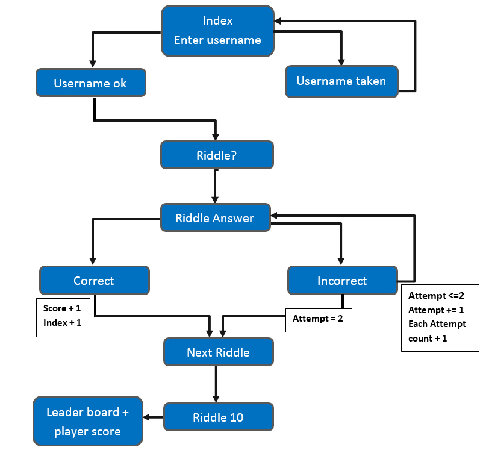
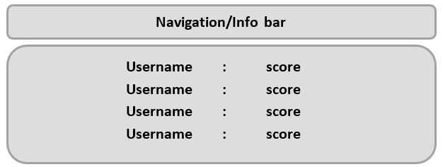
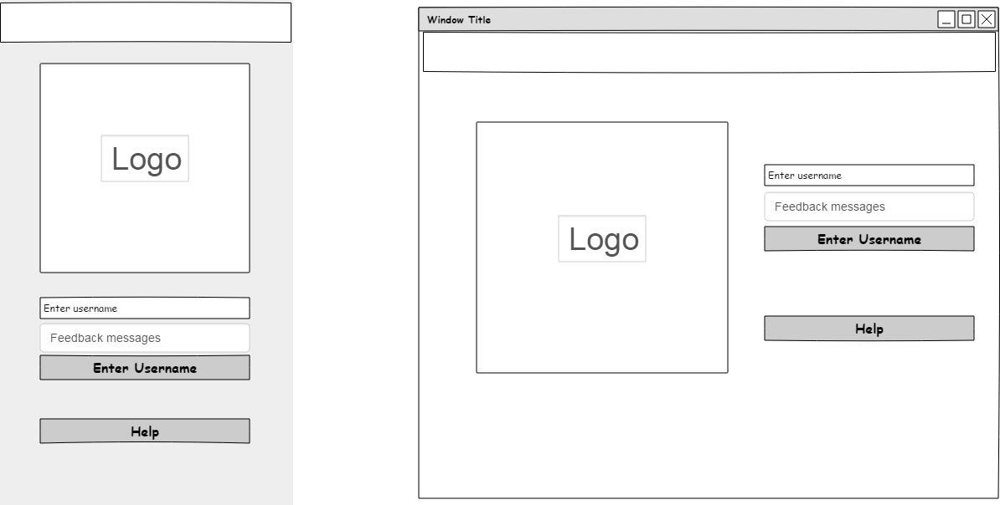
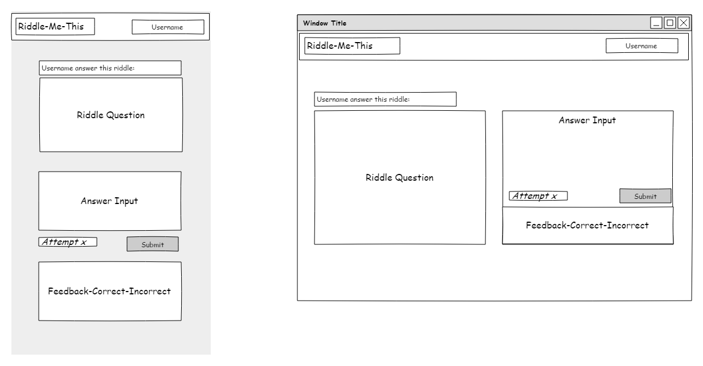
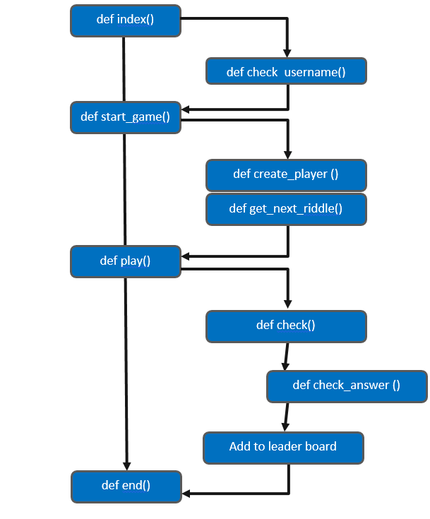

# RIDDLE-ME-THIS Guessing Game

Heroku App: https://practical-python.herokuapp.com/<br>
Heroku git: https://git.heroku.com/practical-python.git<br>
GitHub: https://github.com/Sonnerz/project03-practical-python<br>


**Build a web application game that asks players to guess the answer to a pictorial or text-based riddle**


## Guidelines and Guideline fulfilment

1.	**The project's logic must be written in Python. HTML, CSS, and JavaScript can be used to enhance the look and feel of the game.**<br>
Python, HTML and CSS were used in this project.
2.	**Whenever possible, strive to use semantic HTML5 elements to structure your HTML code better.**<br>
I have used semantic HTML5 elements to structure my HTML
3.	**We recommended taking a TDD approach to building the game.**<br>
a.	**Create a section in your README.md titled 'Testing.' In this section, summarise your approach to testing and provide pseudocode you have written to develop your tests**<br>
b.	**Write and run automated tests to ensure that your website’s functionality works well**<br>
c.	**If you run any manual tests be sure to document those tests in the 'Testing' section of your README**<br>
d.	**If there are any tests that are not running as expected or are failing, provide a summary in the 'Testing' section of your README of what your expected output was and any reasons as to why the test(s) may be failing.**<br>
Testing is covered in the [Testing documentation](Testing.md).
4.	**Use flask, a micro-framework, to structure your project's back-end.**<br>
Flask micro framework has been used. <br>
5.	**Provide instructions on how to deploy your project in your README.**<br>
    Instructions are under the [Deployment](#deployment) section.
6.	**Make sure your site is as responsive as possible. You can test this by checking the site on different screen sizes and browsers.**<br>
The site was developed using Bootstrap 4 and was continually tested using dev tools in Chrome and viewing the site on mobile devices. Testing is covered in the [Testing documentation](Testing.md).<br>
7.	**We advise that you write down user stories and create wireframes/mockups before embarking on full-blown development.**<br>
[User Stories](#scenarios) and [Wireframes](#wireframes) have been provided in this ReadMe.<br>
8.	**The site can also make use of CSS frameworks such as Bootstrap, just make sure you maintain a clear separation between the library code and your code.**<br>
Bootstrap 4 was used and custom css was created as scss files and stored in the static/scss directory <br>
9.	**Write a README.md file for your project that explains.**<br>
a.  **what the project does and the need that it fulfills.** <br>
b.	**It should also describe the functionality of the project, as well as the technologies used.**<br>
c.	**If some of the work was based on other code, explain what was kept and how it was changed to fit your need. A project submitted without a README.md file will FAIL**<br>
A ReadMe file has been provided.
10.	**Use Git & GitHub for version control. Each new piece of functionality should be in a separate commit.**<br>
Git and GitHub have been used and commit comments provided with each git commit
11.	**Deploy the final version of your code to a hosting platform such as Heroku.**<br>
Final version was deployed to Heroku


##  Non-requirements for this project:

1.	Secure user authentication (e.g. via passwords) is not required for this particular project. Having each user just choose a username is sufficient. Secure authentication will be introduced in the Django module.
The player has the ability to choose a username, start a game with the username, resume a game and view their username on the leader board at the end of a game.
2.	Persisting data by writing it in files is not required in this project, and indeed is problematic on Heroku due to its ephemeral filesystem. Instead, prefer to keep all of the data you need in memory (in variables) and/or in Flask sessions. Storing data effectively in a database will be the focus of the next module
Flask session was used to store the player username, variables were used there after for tracking player data.
3.	Your project is not expected to support real-time interaction between users on different browsers. There are ways to achieve this with clever use of js polling or websockets, but it's not a requirement for this project. It's perfectly fine if new data is only retrieved from the backend whenever a user loads a new page.


<hr><hr>
<a name="topofpage"></a>

# Table of Contents

*   [Strategy Plane](#strategy)
    *   [Define roles and responsibilities](#randr)
    *   [Project Charter](#charter)
    *   [Website development Roadmap](#roadmap)
    *   [Strategy Trade-off](#trade)
    *   [Defensive Design](#def)
*   [Scope Plane](#scope)
    *   [Scenarios](#scenarios)
    *   [Functional Specifications](#func)
    *   [Content Requirements](#content)
        *   [Navigation](#nav)
*   [Structure & Skeleton Plane](#sands)
    *   [Information architecture](#architecture)
    *   [Wireframes](#wireframes)
        *   Start Application Page
        *   Application Page
        *   Leader Board Page
*   [Surface Plane](#surface)
    *   [Development Phase](#dev)
        *   [IDE](#ide)
        *   [Version Control](#version)
        *   [Readme](#readmeheader)
        *   [HTML/CSS Structure](#html)
            *   Start Application Page
            *   Application Page
            *   Leader Board Page
            *   Data
            *   SCSS/CSS
        *   [Content Sections](#contsect)
            *   Python
            *   riddleList.py
            *   run.py
            *   test_riddle.py
        *   [Testing documentation](Testing.md)
        *   [Deployment](#deployment)
*  [Credit](#external)


<a name="strategy"></a>
# Strategy Plane
The overall aim of the project is to build a web application game that asks players to guess the answer to a pictorial or text-based riddle.  The logic of the game will be written in Python, HTML, CSS, and JavaScript can be used to enhance the look and feel of the game. 

The player is presented with a riddle they must answer and depending on their answer the game follows one of two paths – a correct answer takes the player to a new question; an incorrect answer gives the player the option to try again.

A leader board displays the players with the highest scores.


<a name="randr"></a>
## Define roles and responsibilities
For the purposes of this project, Sonya Cooley had full authority, primary responsibility, and full accountability for all aspects of the project. 
She had a Mentor available to her throughout the development of the game app.


[Top of page](#topofpage)
<a name="charter"></a>
## Project Charter 
||Objectives |
|:---|:---|
|**Purpose:** What purpose does the website serve?|The web application is for entertainment purposes only. The addition of a leader board adds a competition element to the game|
|**Goals:** What outcomes does it need to achieve?|<ul><li>To entertain players</li><li>Store and display player interaction and scores</li></ul>
|**Target audience:** Whom must the product appeal to and work for?|<ul><li>Puzzle enthusiasts and </li><li>curious site visitors</li></ul>|
|**Success indicators:** How will you know you have achieved project goals?|The leader board is regularly updated|
|**Strategies:** What approaches will help to realise the goals?|<ul><li>We will take a mobile first approach to Content. </li><li>Provide interesting and focused content for our target audience</li><li>Aim to keep the site simple and not over complicated</li><li>Present leader board data in a clear and user-friendly way</li></ul>
|**Tactics:** What activities might help to realise the strategies?|<ul><li>Provide interesting content (riddles) for players</li><li>Provide a user experience that is accessible and enjoyable for all visitors</li><ul><li>following conventions for design and interaction</li><li>providing clear and consistent navigation</li><li>testing usability with a wide range of clients and industry standard tools</li></ul></ul>

[Top of page](#topofpage)
<a name="roadmap"></a>
### Website development Roadmap
The UXD will be driven by the API data and user needs.
|**Define**|Requirements gathering, SEO, Research Competitors,  Content Strategy – Personas, Interesting Riddles.|
|:---|:---|
|**Design**|Information architecture, Functional & technical requirements, Navigation design, Wireframes, UX/UI, Pages, Branding, style guides, mock-ups.|
|**Develop**|Look & feel, Design and Development, Build, Version control, Testing, Deploy|

[Top of page](#topofpage) 

<a name="trade"></a>
### Strategy Trade-off
|Opportunity/Problem|Importance|Viability/Feasibility|
|:---|:---|:---|
|Interesting and fun GUI|5|5|
|Usable GUI|5|5|
|Leader board|5|5|
|Interesting Riddles|5|4|


[Top of page](#topofpage)
<a name="def"></a>
## Defensive Design
Defensive design for our Riddle-Me-This Web application will focus on the most common points of failure: user input areas, feedback and server problems.
*	I will employ validation to check for user mistakes before they frustrate the player
*   I will protect players from server errors and broken links with informative messages
*   My Defensive design will assist the player before mistakes happen.


If players are unsuccessful with their guess, they will be informed by on screen messages and provided with the option of guessing the answer again. 
Their guesses will be limited to 2 attempts and on-screen text will inform players of how many attempts remain.

Players will be allowed to enter a username to appear on the leader board when they finish a game. They will be informed if that username has already been taken and asked to enter a different username option.

The input area will be protected against malicious code.
A pattern will be added to the input form controls to only allow the input of letters and numbers, no special characters will be allowed: pattern="[A-Za-z0-9]{1,50}"


[Top of page](#topofpage)
<a name="scope"></a>
# Scope Plane
The project scope is based on our defined Strategy.
Scoping will;
*   fully define the web application requirements 
*   determine the key functionalities
*   determine what features are to be included in this and possible future product releases

The Riddle-Me-This application will target puzzle enthusiasts and attract casual site visitors. The site will provide riddles for players to solve. A combination of images, and HTML5 will be used to make the interface useful and interesting. Semantic HTML will used throughout and the site will be responsive to a broad range of devices.
Python and the Flask micro-framework will be the primary technologies used to implement the application functionality.


[Top of page](#topofpage)

<a name="scenarios"></a>
## Scenarios
### Puzzle enthusiast:
A puzzle enthusiast will be a player who is familiar with riddles and their veiled meaning. They will most likely be familiar with a game 
interface where player input is required. They will also be familiar with leader boards and the information they provide.
They will expect features for example, a defined number of attempts, attempt count indicator, input area and good feedback.<br>
A puzzle enthusiast may:
1.  Log in to the game
2.  Attempt all 10 riddles
3.  View the leader board at the end of the game
4.  They may also view the leader board during the game


### Puzzle player:
A puzzle player will visit the site out of curiosity to investigate a possible new riddle source. They may attempt a few riddles and then abandon the 
game when they answer incorrectly or they may continue until they appear on the leader board.<br>
A puzzle player may:
1.  Log in to the game
2.  Attempt some riddles
3.  May abandon the game

### Casual player:
A casual player will visit the site out of curiosity to investigate the type of game. They may attempt a few riddles and then 
abandon the game when they answer incorrectly. They may not visit the leader board.<br>
A casual player may:
1.  attempt to play the game without logging in
2.  Attempt some/none riddles
3.  Randomly view the leaderboard
4.  May abandon the game
  

[Top of page](#topofpage)

<a name="func"></a>
## Functional Specifications

The site will provide players with access to a series of Riddles.
The site will provide the ability for players;
*   to enter a username and be identified by that username
*   to provide answers to the riddles
*   to make 2 attempts at a riddle answer
*   to have their score recorded
*   to have their score appear on a leader board, sorted by score
*   to have the correct answer provided to them after 2 attempts

The Riddle-Me-This application will be optimised for latest version of Chrome, Firefox, Internet Explorer, Safari and Opera and 
optimised for mobile usage. HTML and CSS will be written using the Mobile-First approach. The mobile-first approach is designing for the 
smallest screen and working your way up to desktop.




[Top of page](#topofpage)
<a name="content"></a>
##    Content Requirements
The Riddle-Me-This application will follow a standard format, with a HTML5 structure based on Bootstrap 4. 
The application will have a sticky navbar/info bar always available to players.
The game interface will provide players with; 
*   a username entry
*   a username entry submit button
*   game help information
*   the riddle question, 
*   an answer input area,
*   a submit button
*   a feedback area
*   an attempt count display
*   an answer area whether it’s correct or incorrect
*   a leader board
*   navigation to the leader board 

All html pages will be created using HTML5 and CSS3, supported by the Bootstrap 4.0 Framework 

**Start Page**<br>


**Application structure**<br>


**Leader Board structure**<br>



<a name="nav"></a>
### Navigation
The navbar/info bar will be available to players at the top of the game application.
It will provide navigation to the leader board, navigation to the start page and the identity of the player.


[Top of page](#topofpage)
<a name="sands"></a>
#  Structure & Skeleton Plane
Our goal for the Structure plane is to organise the information architecture and interactions for the application. We will keep a consistent, predictable, and learnable interface that game users would be familiar with. We will use industry standard technologies to implement expected behaviours when using the application, e.g. tooltips, navigation, including accessibility, etc.
Users will find navigation and user information at the top of the application. 
The input fields will follow user expectations where feedback is provided if user interactions are unexpected, correct or incorrect.


<a name="architecture"></a>
## Information architecture
The entire application will be implemented in three pages. 
The application directories and files will be organised in the following way;


|<ul><li>Site Root</li><ul><li>Procfile</li><li>ReadMe</li><li>Requirements.txt</li><li>riddleList.py</li><li>run.py</li><li>test_riddle.py</li></ul></ul>|<ul><li>Static Directory</li><ul><li>css</li><li>images</li><li>js</li></ul></ul><ul><li>scss</li><ul><li>scss files for css</li></ul></ul><ul><li>Templates Directory</li><ul><li>404.html</li><li>500.html</li><li>base.html</li><li>end.html</li><li>index.html</li><li>play.html</li></ul></ul>|
|:---|:---|


[Top of page](#topofpage)
<a name="wireframes"></a>
##  Wireframes
## Start Application Page (‘/’ index.html)<a name="apodwf"></a>

## Application Page (‘/play’ play.html)<a name="epicwf"></a>

## Leader Board Page (‘/end’ end.html)<a name="librarywf"></a>


[Top of page](#topofpage)
<a name="surface"></a>
#  Surface Plane

<a name="dev"></a>
## Development Phase

<a name="ide"></a>
### IDE
The web application will be developed using the Cloud9 IDE. 
Cloud9 IDE is an online integrated development environment, that supports hundreds of programming languages. 
It enables developers to get started with coding immediately with pre-configured workspaces, collaborate with their peers
with collaborative coding features, and web development features like live preview and browser compatibility testing.


<a name="version"></a>
### Version Control
Git will be used to manage the source code for this project. Git is a version control system for tracking changes in project files.
Project files will be committed to Git after each major functional addition, update or implementation of testing results.
Following the initial commit to Git, each major update will be followed by a Git add and commit. 
**A full Git log is available on the GitHub project repository.**


<a name="readmeheader"></a>
### Readme
A Readme markdown file is provided with the site on GitHub. It explains what the project does and the need that it fulfils. 
It also describes the functionality of the site, the technologies used and how it was tested. 

The Readme provides information on how the site was deployed and tested and if some of the work was based on other code.


[Top of page](#topofpage)
<a name="html"></a>
### HTML/CSS Structure
**Start Application Page**

The web application start page gives the player the options of; starting the game by entering a username, or viewing the game help.  A logo will take a prominent position on the page. The options; play the game, and view help will be placed beside the logo.
The page and its functionality will be created using the Bootstrap 4 Framework, Python and The Flask micro-framework.


**Application Page**

The web application game page displays the riddle question and provides a text input area where the player can enter their answer. After clicking the submit button, the answer will be evaluated and feedback will be provided in the message area under the submit button.
An attempt count will be provided below the answer input area.
The page and its functionality will be created using the Bootstrap 4 Framework, Python and The Flask micro-framework.


**Leader Board Page**

The leader board page will provide players with a list of the top 15 scoring players.
The list will show the username, score and the timestamp when that score was created.
The page and its functionality will be created using the Bootstrap 4 Framework, Python and The Flask micro-framework.

**Data**

The riddles and answers will be read from a python file (riddlesList.py) on the application site and the usernames will be stored as a dictionary in a python list.

**SCSS/CSS**

Bootstrap 4 provides the fundamental HTML5, CSS and JavaScript for the application to ensure that it meets the Responsive requirement.
However, custom styles have been created and a styles.css file can be found in the static/css directory.

Custom styles for each page, and bootstrap overrides are in their own SCSS file.
<ul><li>base.scss </li><li>
bootstrap-overrides.scss</li><li>
end.scss</li><li>
index.scss</li><li>
mixins.scss</li><li>
Play.scss</li><li>
Styles.scss</li><li>
variables.scss</li></ul>

[Top of page](#topofpage)
<a name="contsect"></a>
###  Content Sections - Python

<ul><li>run.py file has been created for the app code</li><li>
test_riddle.py contains unittests for the app</li><li>
riddlesList.py contain the riddle questions and answers </li></ul>

####    **riddleList.py**

Content structure inspired by sentdex on YouTube: https://www.youtube.com/channel/UCfzlCWGWYyIQ0aLC5w48gBQ

Each riddle is a dictionary withing a Tuple. As the riddles can't be altered by players, a tuple was deemed a suitable data structure as the data can't be updated.


*Content function: Dictionary inside riddles tuple*

Riddle dictionary:
```
{ 
“Question”: value,
“Answer”: value,
“Number”: value,
“Path”: value
}
```
riddles tuple:
```Python
def content():
    riddles = (
                {
                    "Question": "What belongs to you but others use it more than you do?",
                    "Answer": "name",
                    "Number": 0,
                    "Path": ""
                 },
                 {
                    "Question": "Work out this Anagram: edlpoemvent",
                    "Answer": 'development',
                    "Number": 1,
                    "Path": ""
                 },...
            )
```
####    **run.py**

```Python
riddles = content()

    app = Flask(__name__)
    app.secret_key = 'The cat is on the roof'
    usernames = []
    leaderboard = []
    player_info = []
    riddle = {}
```
Set riddles to be the value of content() imported from riddlesList.py

Global variables: 
* 'usernames': Python List,
* 'leaderboard': Python List, 
* 'player_info': Python List,
* 'riddle':  Python dictionary.

***

Leader board list contains a dictionary for each entry with key values: <br>username, score, timestamp
```Python
leaderboard = []
{
"username": session['username'],
"score": player['score'],
"timestamp": date_completed
}
```
***
Player info list contains a dictionary for each entry with key values: <br>username, score, attempt, wrong, riddle_number, attempt_total, restart, resume.


```Python
Player_info = []
{
"username":username,
"score":0,
"attempt":0,
"wrong":0,
"riddle_number":0,
"attempt_total":0,
"restart":False,
"resume":False
}
```
***
Riddle dictionary; for each entry has key values: <br>Question, Answer, Number, Path
```Python
riddle = {}
{
“Question”: value,
“Answer”: value,
“Number”: value,
“Path”: value
}
```
**Function order in run.py**<br>


    @app.route('/', methods=["GET", "POST"])
        def index():
        
*   index() - This function takes the username from the form on index.html
*   sends the username to check_username()
*   if check_username() returns True, we are redirected to start_game()


***

    def check_username(username):
        
*   check_username() function takes the username from index()
*   it checks if the username is already taken or in session so that user can start/restart/resume
*   If a new player is _not_ in the usernames list and _does not_ have an active session they enter a username and can continue on to play the game.
*   If a person _is in_ the usernames list and _does not_ have an active session they must enter a new username and can continue on to play the game.
*   If a person _is not_ in the usernames list and _does_ have an active session they can enter their username and continue on to play/restart/resume the game.
*   If a person _is in_ the usernames list but _does not_ have an active session they are asked to choose a different username


***

    @app.route('/start_game', methods=["GET", "POST"])
        def start_game():
    
*   start_game() function decides what riddle a player is to be presented with
*   If the player is resuming they get the last riddle they were answering
*   If the player is restarting they get the first riddle
*   If they are a new user, a new player{} is created create_player() they get the first riddle


***

    @app.route('/play')
        def play():
        
*   play() function decides if a person is in session they can load play.html otherwise they are redirected to the log in page index.html

***


    @app.route('/checkPlayerInput', methods=["GET", "POST"])
        def check():

*   check() is called by the input form on play.html
*   It takes the players answer (player_answer) and if it's a digit it is sent to number_to_string() otherwise
*   The answer is sent to check_answer() for processing/checking
*   The current riddle number is requested by the function from the input form
*   The riddle number (player_current_riddle_number) is passed to get_riddle() to get that players current riddle
*   The riddle number is checked that it is not the last riddle (#10)
*   It the riddle number is #10 the game is over and the score is appended to the leaderboard otherwise the player can continue on


***

    def check_answer(answerInputByPlayer, riddle):
 
*   The player answer is checked against the riddle answer
*   scores are increased and attempts increased if needed
*   If the player has 2 attempts they are told the answer
*   An updated player{} is returned to the check()


***


    @app.route('/end')
        def end():

*   The leaderboard list is sorted by score in descending order and rendered to end.html


***

    @app.context_processor
    def debug_on_off():
        return dict(debug=app.debug)
    
*   creating a debug variable for hiding/showing the debug panel on each html page


***

    def get_riddle(riddleIndex):
        '''
        If answer is correct or attempts are more than two, get the next riddle from the riddle List, based on the riddle number
        '''
        # get next riddle by passing index to riddles[] and return the riddle {} dictionary
        nextRiddle = riddles[riddleIndex] 
        return nextRiddle

*   get_riddle() gets the next riddle from riddles based on it's index number


***

    def create_player(username):
        
*   create_player() creates a player{} inside the player_info list    


***

    def number_to_string(number):

*   Helper function - to change a digit to the word version of a number e.g. 7 to seven 


***

    @app.errorhandler(404)
    def page_not_found(error):
        '''
        404 error is redirected to 404.html
        '''
        return render_template('404.html')
        

    @app.errorhandler(500)
    def internal_error(error):
        '''
        500 error is redirected to 500.html
        '''
        session.pop('_flashes', None)
        session.pop('username', None)
        return render_template('500.html') 

*   Decorators to catch errors before they happen and redirect players to user friendly pages


**test_riddle.py**

More in [Testing documentation](Testing.md).

Tested: get_riddle() function<br>
Tested: ensure that a session gets created<br>
Tested: that a response is received from the html files<br>
Tested: create_player() function<br>
Tested: check_username() function<br>
Tested: helper function  - number_to_string()


[Top of page](#topofpage)


<a name="deployment"></a>
### Deployment
I pushed the code to GitHub .
I create a repository in GitHub<br>
https://github.com/Sonnerz/project03-practical-python


1.  `` $ git remote add origin https://github.com/Sonnerz/project03-practical-python `` 
2.  `` $ git push -u origin master``
3.  `` Enter: _username_``
4.  `` Enter: _password_``

Heroku is used to host the code and publish the app publicly.

I logged into Heroku and created a new app called **practical-python**<br>
I chose the European hosting region<br>
A git repo was created: https://git.heroku.com/practical-python.git<br>
A heroku app url was provided:  https://practical-python.herokuapp.com/<br>

In a cloud9 terminal, I ran the following commands:
1.  `` $ git add .`` 
2.  `` $ git commit -m "comments about readme updates"`` 
3.  `` $ heroku`` 
4.  `` $ heroku login`` 
5.  Enter: _username_
6.  Enter: _password_
7.  `` $ heroku apps`` (to confirm my app was there)
8.  `` $ git remote -v``
9.  `` $ git remote add heroku https://git.heroku.com/practical-python.git`` 
8.  `` $ git push -u heroku master`` 

**This build failed. :(**

Error:
Could not find a version that satisfies the requirement pygobject==3.12.0 (from -r /tmp/build_dac2400feea2848d7bae10ab941d8a29/requirements.txt (line 20)) (from versions: 3.27.0, 3.27.1, 3.27.2, 3.27.3, 3.27.4, 3.27.5, 3.28.0, 3.28.1, 3.28.2, 3.28.3, 3.29.1.dev0, 3.29.2.dev0, 3.29.3.dev0)
       No matching distribution found for pygobject==3.12.0 (from -r /tmp/build_dac2400feea2848d7bae10ab941d8a29/requirements.txt (line 20))
 <br>!     Push rejected, failed to compile Python app.
 <br>!     Push failed
 
**To solve the problem I recreated the requirements.txt file**

I deleted the requirements.txt file<br>
In Heroku under the app settings I added the following config vars:<br>
IP - 0.0.0.0<br>
PORT - 5000

In a cloud9 terminal, I ran the following commands:
1.  `` $ heroku`` 
2.  `` $ heroku login`` 
3.  Enter: _username_
4.  Enter: _password_
5.  `` $ git remote -v``
6.  `` $ sudo pip3 freeze --local > requirements.txt``
7.  `` $ git add requirements.txt``
8.  `` $ git commit -m "req.txt updated after failed heroku push"``
9.  `` $ git push -u heroku master``
10.  `` $ heroku ps:scale web=1``
  

I confirmed that the site was live at https://practical-python.herokuapp.com/


[Top of page](#topofpage)

<a name="external"></a>
# Credit
##  Content/ Acknowledgements

The following sites were used as resources to get sample css and debugging css.

|Site|URL|Resource
|:---|:---|:---|
|Stack Overflow|http://stackoverflow.com|Code snippets/idea throughout the project
|w3schools Python|https://www.w3schools.com/python/|How to access dictionaries, etc
|Mentor - Chris Zelinski||Helped with my app logic in the mid project meeting and GET/POST methods
|Flask|http://flask.pocoo.org/docs/1.0/quickstart/|Went back to basics to learn about flask
|Youtube|https://www.youtube.com/channel/UC-QDfvrRIDB6F0bIO4I4HkQ|Pretty Printed flask content
|Youtube|https://www.youtube.com/channel/UCfzlCWGWYyIQ0aLC5w48gBQ|Sentdex Flask content
|Website|https://www.patricksoftwareblog.com/unit-testing-a-flask-application/ |Flask unit testing
|Slack||Slack members tested my app as users


##  Media

|Media|Scource|
|:---|:---|
|Riddler background image|https://www.desktopbackground.org/
|Running water in riddle about tank	|http://worldartsme.com/
|Tank riddle image|http://oddmenot.com
|Riddles and answers|https://riddles.fyi/
|Riddle Me This|Sonya Cooley created in Photoshop
|Google Fonts|Margarine


[Top of page](#topofpage)


